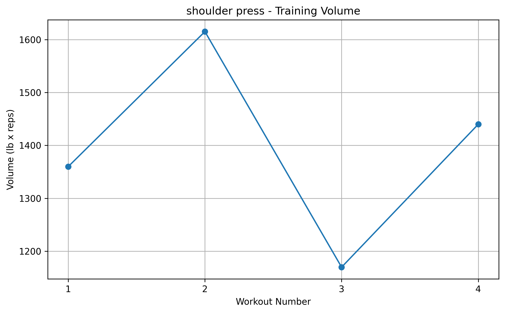
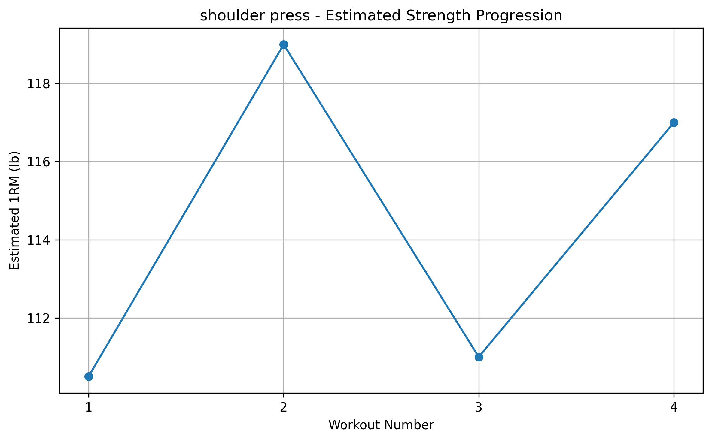

# Gym Strength Analyzer

A Python data science project that analyzes resistance-training performance and tracks strength progression using MY real workout data.

## Project Overview

This project uses workout data collected from my own training sessions to analyze how performance changes over time.

The program allows a user to select an exercise and automatically calculates:

- Total training volume
- Estimated one-rep max (1RM)
- Percentage change in training volume
- Percentage change in estimated strength
- Best estimated 1RM
- Workout-to-workout progression

It also generates visualizations showing changes in training volume and estimated strength.

## Technologies Used

- Python
- Pandas
- Matplotlib
- CSV data processing

## Dataset

The dataset contains individual workout sets with the following variables:

- `workout_number`
- `workout_type`
- `exercise`
- `set_number`
- `weight_lbs`
- `reps`
- `notes`

Each row represents one completed set.

## Feature Engineering

### Training Volume

Training volume is calculated as:

`Volume = Weight × Repetitions`

This provides a simple measure of total workload performed during a set.

### Estimated One-Rep Max

Strength is estimated using the Epley formula:

`Estimated 1RM = Weight × (1 + Reps / 30)`

This allows performance to be compared even when the weight and number of repetitions change between workouts.

## Example Visualizations

### Training Volume



### Estimated Strength



## Project Structure

```text
gym-strength-analyzer/
├── data/
│   └── workouts.csv
├── images/
│   ├── training_volume.png
│   └── estimated_strength.png
├── notebooks/
├── src/
│   └── analysis.py
├── .gitignore
└── README.md
```

## How to Run

Install the required Python libraries:

```bash
python3 -m pip install pandas matplotlib
```

Run the analyzer:

```bash
python3 src/analysis.py
```

Then select an exercise from the list displayed in the terminal.

## Future Improvements

Future versions of this project could include:

- Larger workout datasets
- Actual workout dates
- Automatic plateau detection
- Exercise-to-exercise comparisons
- Strength prediction using machine learning
- Interactive dashboard